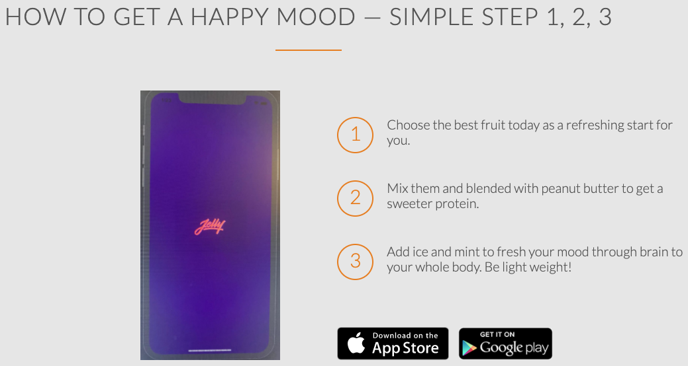

# HTML-onboarding-project
HTML BASICS

### Header html and css


### section1: use fluid grid system to build coloums


### section2: image layout and animation
1. image: add a dark(black color background) mask on image's container
2. zoom out and become brighter animation


### section3: steps layout 
1. radius image,
2. number and text in one line: inline-block, float: left



### section3: 4 box layout with items
1. icon and text align together in one-line
```
/* secrets to align icons and text */
    line-height: 120%;
    vertical-align: middle;
    margin-top: -4px;
```


