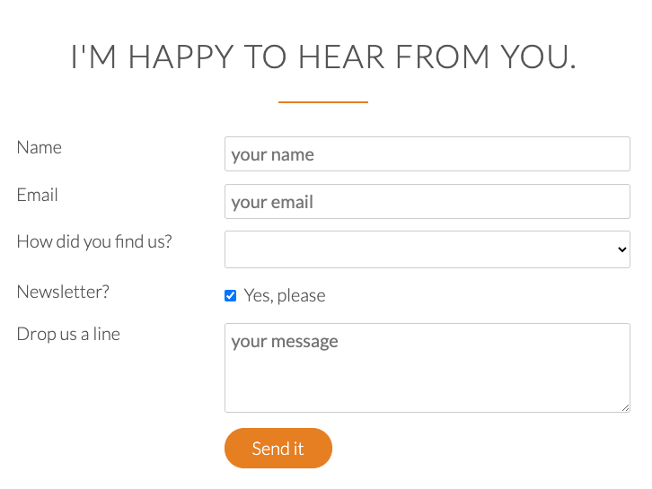
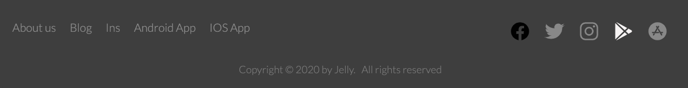
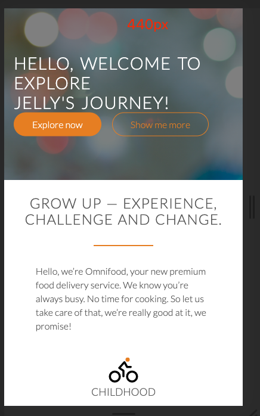
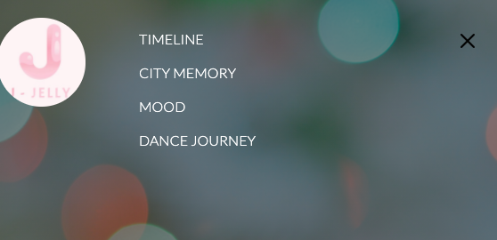

# HTML-onboarding-project
HTML BASICS

### Header html and css


### section1: use fluid grid system to build coloums


### section2: image layout and animation
1. image: add a dark(black color background) mask on image's container
2. zoom out and become brighter animation


### section3: steps layout 
1. radius image,
2. number and text in one line: inline-block, float: left


### section4: 4 box layout with items
1. icon and text align together in one-line
```
/* secrets to align icons and text */
    line-height: 120%;
    vertical-align: middle;
    margin-top: -4px;
```


### section5: feedbacks
1. `blockquote tag` `cite` tag
2. linear gradient background color
3. quotation marks `:before` tag
4. absolute(child) vs relative(parent)


### section6: contact form
* input: type = `text, email, checkbox, submit`
* select
* textarea



### section7: footer
* darker mask with white/gray text
* social media icon-color
* transition when hover: color changes



### section6: responsive UI with media query

1. **0 <= size <= 480px :** old small phone screen
2. **481px <= size <= 767px :** phone to tablet screen
3. **768px <= size <= 1023px :** bigger tablet / landscape view of tablets
4. **1024px <= size <= 1200px :** close to our max row width( which is set to 1140px on all browsers)



5. Add different browser and old browser supportive soluton
   install 3 scripts to improve css features:
   
    • `respond.js`
        respond.js which enables the browser to understand and execute CSS media queries which we need for responsive web design.
        https://www.jsdelivr.com/package/npm/respond.js?path=dest

    • `HTML5Shiv`
        This enables us to use and style HTML5 elements in older browsers that were available before HTML5 actually existed.
        https://www.jsdelivr.com/package/npm/html5shiv

    • `selectivizr`
        And this allows us to use CSS3 pseudo classes like less child and first child. Or Internet Explorer 6, 7, and 8.
        https://www.jsdelivr.com/package/npm/selectivizr
        
        
### Section7: mobile nav with jquery
1. use jquery
2. add animation when scrolling
3. build responsive mobile navigation bar



